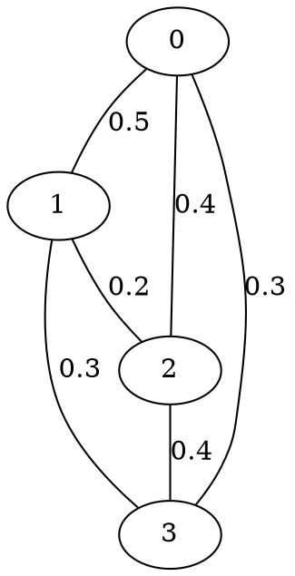
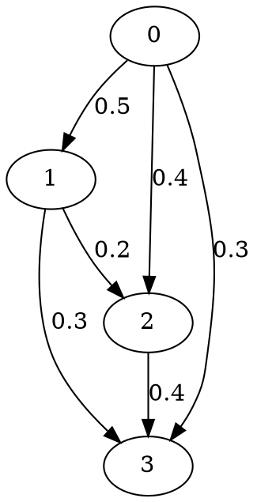

# Анализ связности графов

Анализ вероятностных характеристик случайных графов методом Монте-Карло и полным перебором.

## Параметры

### NUM_SIMULATIONS

Список количеств симуляций для метода Монте-Карло. Каждое значение даёт точку на графике сходимости.

```python
NUM_SIMULATIONS = [1, 10, 100, 1_000, 2_000, 10_000]
```

### A, B

Начальная и конечная вершины для проверки существования пути (ЛР1).

```python
A = 0
B = 3
```

## Ввод

Файлы графов в формате `.dot` помещаются в директорию `input/`.

### Формат графа

Неориентированный граф:


Ориентированный граф:


`label=X` — вероятность наличия ребра (от 0.0 до 1.0). Если не указано, по умолчанию 0.5.

## Методы

### Метод Монте-Карло

Для каждого количества симуляций `N`:
1. Генерируется случайный граф — каждое ребро включается с вероятностью из `label`
2. Проверяется условие (существование пути / полная связность)
3. Повторяется `N` раз
4. Вероятность = успешные прогоны / всего прогонов

### Полный перебор

Для графа с `M` рёбрами:
1. Перебираются все `2^M` возможных подграфов
2. Для каждого подграфа вычисляется вероятность = произведение вероятностей рёбер
3. Суммируются вероятности подграфов, удовлетворяющих условию

## Вывод

Результаты сохраняются в `results/<имя_графа>/`:

| Файл | Описание |
|------|----------|
| `result.txt` | Итоговые результаты для ЛР1 и ЛР2 |
| `connectivity_comparison_chart.png` | График сходимости Монте-Карло (ось X — логарифмическая) |
| `original_graph.png` | Визуализация исходного графа (требуется graphviz) |

### Формат result.txt

```
Graph: graph1
N=4, A=0, B=3

LR 1: Probability of path existence from A to B
1) Monte-Carlo simulation:          0.51570000 (N=10000)
2) Full enumeration of subgraphs:   0.51700000

LR 2: Probability of connected graph
1) Monte-Carlo simulation:          0.31000000 (N=10000)
2) Full enumeration of subgraphs:    0.30768000
```

## Запуск

```bash
python main.py
```

Обрабатывает все файлы `.dot` из директории `input/`.